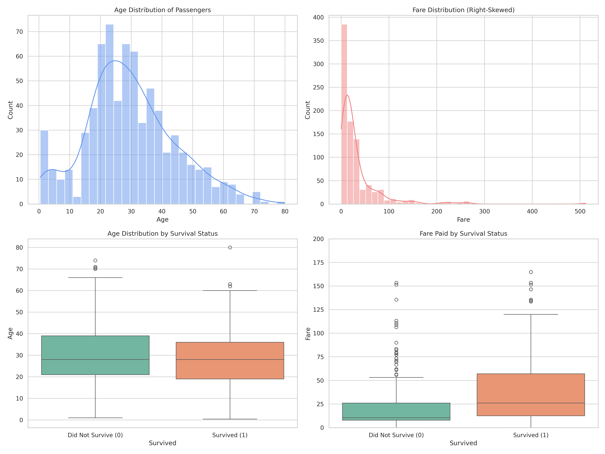
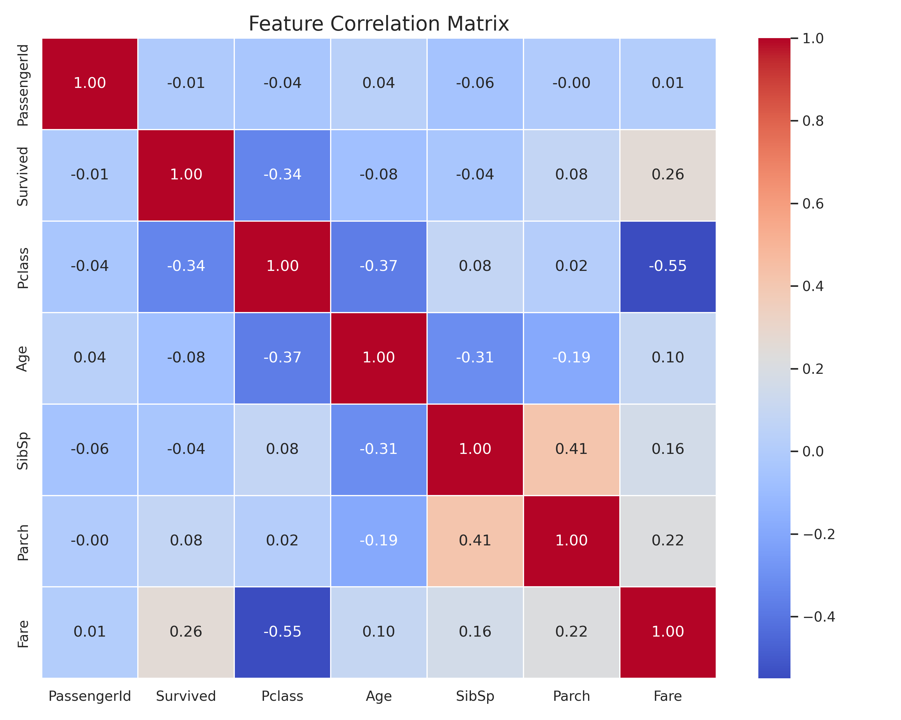
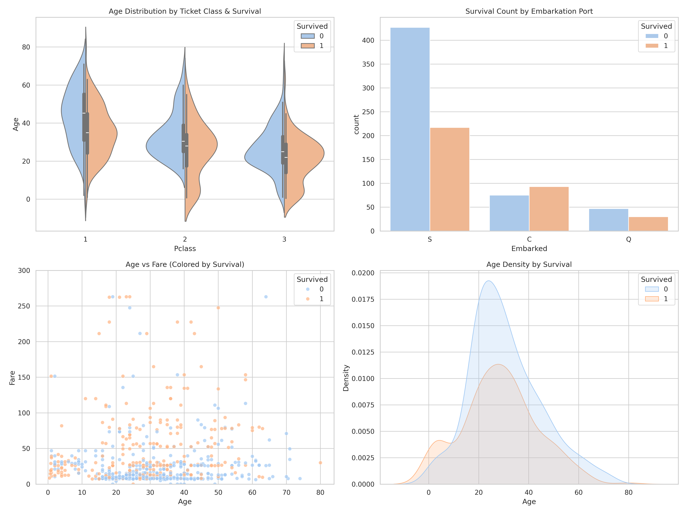
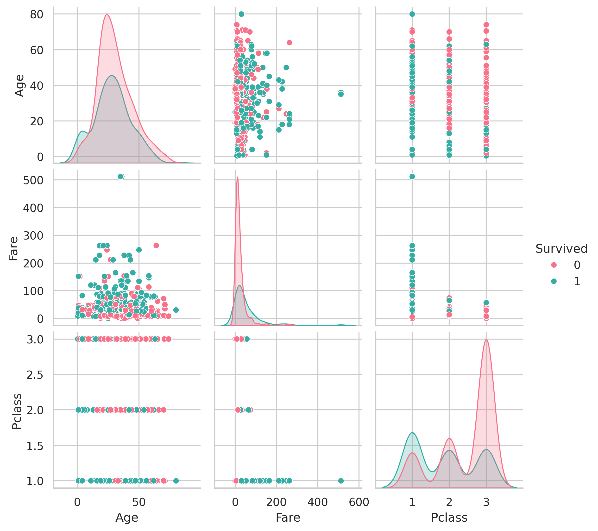

# Elevate Labs AI & ML Internship - Task 2: Exploratory Data Analysis (EDA)

## Task Objective
Understand data using statistics and visualizations.

## Tools Utilized
* Pandas, Matplotlib, Seaborn, Plotly

## Methodology & Execution
This project fulfills the core task requirements through the following steps:
1. Summary Statistics: Generated statistical summaries (mean, median, standard deviation) to understand feature distributions.
2. Feature Distributions: Created histograms and boxplots for numeric features to visualize spread and identify extreme outliers.
3. Relationship Mapping: Built pairplots and correlation matrices to map multi-variable relationships and check for collinearity.
4. Data Investigation: Identified core patterns, trends, and anomalies within the dataset.
5. Visual Inference: Extracted basic feature-level inferences directly from the generated visualizations.

## Key Skills Demonstrated
* Data visualization
* Descriptive statistics
* Pattern recognition

## Files in this Repository
* `Task_2_Titanic_EDA.ipynb`: The Jupyter Notebook containing the full Python code, statistical outputs, and visualization plots.
* `Titanic-Dataset.csv`: The dataset analyzed in this project.
* `README.md`: Project documentation and interview question answers.
### 1. Histograms and Boxplots

### 2. Correlation Matrix

### 3. Advanced EDA Dashboard

### 4. Pairplot

---

## Interview Questions & Answers

1. What is the purpose of EDA?
EDA is used to understand data using statistics and visualizations. It helps uncover underlying structures, detect anomalies, test assumptions, and check relationships before applying modeling algorithms.

2. How do boxplots help in understanding a dataset?
Boxplots help visualize numeric features by displaying their median, quartiles, and extremes. They are specifically useful for instantly identifying outliers and understanding data spread.

3. What is correlation and why is it useful?
Correlation measures the strength and direction of the linear relationship between two variables. It is useful for understanding feature relationships and detecting redundancy.

4. How do you detect skewness in data
Skewness can be detected visually by looking at the shape of histograms or statistically by calculating the skewness coefficient.

5. What is multicollinearity?
Multicollinearity occurs when two or more independent variables in a dataset are highly correlated, providing redundant information that can destabilize machine learning models.

6. What tools do you use for EDA?
Standard tools include Pandas for data manipulation, and Matplotlib, Seaborn, and Plotly for visualizations.

7. Can you explain a time when EDA helped you find a problem?
During data inspection, utilizing a correlation matrix and boxplots immediately revealed extreme outliers and significant missing data, preventing the model from training on broken data.

8. What is the role of visualization in ML?
Visualization translates raw numbers into visual trends, making it significantly easier to identify patterns, trends, or anomalies in the data that would be difficult to spot in raw statistical tables.
